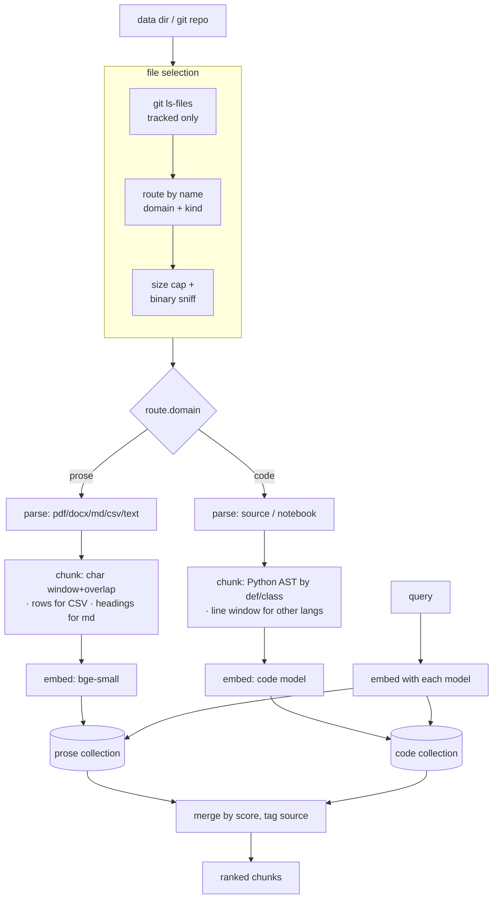

<div align="center">

# Self Knowledge Base Retrieval For Humans and AI

Local, vector-only RAG over a mixed-format document corpus. No server, no orchestration framework, no cloud.

<p>
  <a href="https://github.com/aghontpi/self-knowledge-base-retrieval/blob/main/LICENSE"></a>
</p>

</div>

## Why

> I have a lot of notes I maintain over the years from 2016, its a collection of different fileformats, I wanted something that can query locally and find it without doing find in files all the time, although find in files is still good, lol. 
> 
> I also wanted to use this for talking to local ai where those local agents can queery it (note Local!)

Files are selected, parsed, chunked, embedded with local models, and stored in **[Milvus Lite](https://milvus.io/docs/milvus_lite.md)** (an embedded `.db` file). Ingestion is **convergent**: re-running it makes the index match the corpus exactly — that is the entire "update the knowledge base" story.

The corpus is heterogeneous (prose **and** code), so the index is split into two
**domains**, each with its own collection and embedding model:

| domain | content | model |
|---|---|---|
| **prose** | markdown, text, PDF, docx, CSV, config | `BAAI/bge-small-en-v1.5` (384-d) |
| **code** | source files, notebooks | `ibm-granite/granite-embedding-311m-multilingual-r2` (768-d) |

Vectors from different models aren't comparable, so they live in separate
collections. A query is embedded with each model, searched against each
collection, and the hits are merged.

Retrieval is built and verified *first* — no answer-generating LLM is wired in
yet. Eyeball the retrieved chunks before trusting generation on top of them.

## Pipeline



## File selection — the part that matters for a messy corpus

Three gates, cheapest first (see [discovery.py](src/retrieval_assistant/discovery.py)
and [routing.py](src/retrieval_assistant/routing.py)):

1. **Listing** — if the data dir is a **git repo**, only `git ls-files` (tracked)
   files are considered, which excludes `node_modules`, virtualenvs, build output,
   and anything gitignored for free. Set `PRA_USE_GIT=0` to walk the tree instead.
   > **Note:** with git mode on, *untracked* files (e.g. PDFs you never committed)
   > are not indexed. Commit them or set `PRA_USE_GIT=0`.
2. **Routing** — a file maps to a domain+kind by name, or is skipped. Skipped:
   binaries/archives/images/keys, editor swap files, backup-wrapped names
   (`5.py.save`, `81.txt.completed`), IDE dirs (`.idea`, `.vscode`), `.gitmodules`,
   and extension-less files.
3. **Content guards** — a **size cap** (`PRA_MAX_FILE_MB`, default 1 MB — drops
   data dumps and DB blobs like a 900 MB `.db2`) and a **binary sniff** (null byte
   / invalid UTF-8 in the first 8 KB — catches *mislabeled* binaries regardless of
   extension).

## Chunking — per content type

| content | strategy | locator |
|---|---|---|
| prose (text/md/pdf/docx) | character window + overlap (`PRA_CHUNK_SIZE`/`PRA_CHUNK_OVERLAP`) | `p.3`, `¶7`, heading |
| Python code | **AST** — one chunk per function / class (+ module preamble) | `L12-40` |
| other code | line window + overlap (`PRA_CODE_MAX_LINES`/`PRA_CODE_OVERLAP_LINES`) | `L1-80` |
| CSV / tabular | one row → one chunk (`col: value | col: value`) | `row.5` |
| notebooks | per cell (code + markdown sources) | `cell.3[code]` |

## How it stays correct

- **Convergent sync, not append.** Every chunk row stores `doc_id` (path relative
  to the data dir) and `file_hash` (sha256). Each ingest diffs the filesystem
  against stored hashes *per collection*: new → insert, changed → delete+reinsert,
  removed → delete. Re-running converges each collection to the corpus.
- **Deterministic primary key:** `sha1(f"{doc_id}::{chunk_index}")` (not auto-id),
  so an upsert overwrites a chunk in place.
- **One model per collection.** The model name is stored per row; ingest refuses
  to mix models in a collection. Changing a domain's model = rebuild that
  collection.
- **Cosine + AUTOINDEX** matched to L2-normalized embeddings.

## Install

Requires **Python ≥ 3.10**.

```bash
python3 -m venv .venv && source .venv/bin/activate
make install          # pip install -e ".[dev]"
cp .env.example .env  # optional; point PRA_DATA_DIR at your corpus
```

First ingest/query downloads the two embedding models to your local Hugging
Face cache.

## Usage

```bash
# Point at a corpus (a folder, ideally a git repo)
export PRA_DATA_DIR=/path/to/your/repo

make ingest                 # converge both collections;  pra ingest -v  lists files
make query Q="how is retry implemented?"
pra query "..." -k 8        # override top-k
pra query "..." --no-rerank # skip reranking; show domain-grouped results
make stats                  # per-collection document/chunk counts
```

By default a **cross-encoder reranker** re-scores candidates from both
collections on one consistent scale and returns a single ranked list:

```
#1  [code]  rerank=7.82 (cos=0.71)  utils/retry.py (L20-58)
        def with_retry(fn, attempts=3): ...
#2  [prose] rerank=4.10 (cos=0.66)  README.md (Retries)
        Requests are retried with exponential backoff …
```

### Why rerank — cross-model scores aren't comparable

The two domain models live on different scales: on a real corpus the code model
handed out ~0.5–0.66 even to irrelevant hits while bge gave ~0.34–0.39 to
perfect ones, so a raw-score merge let code bury prose. Two fixes ship:

- **Grouping** (`--no-rerank`) — show `=== code ===` / `=== prose ===`
  separately, each ranked on its own scale. Zero extra model.
- **Reranking** (default) — a cross-encoder reads each `(query, chunk)` pair
  *together* and scores them on one scale, so code and prose compete fairly.
  Pulls `PRA_RERANK_CANDIDATES` per domain, then keeps the best `top_k`. Also
  fixes the code model over-rewarding very short snippets.

## Updating the knowledge base

There is no separate "update" step — **just run `pra ingest` again.** Add, edit,
or delete files in the corpus and re-ingest; each collection converges to match.
To change a domain's embedding model, drop that collection (or delete the `.db`)
and re-ingest — vectors from different models aren't comparable, so it's a
rebuild, not an update.

## Model Context Protocol (MCP) Server

The Personal Retrieval Assistant includes a **Model Context Protocol (MCP)** server. This allows LLM clients (such as Claude Desktop, Cursor, or other MCP-compatible clients) to query and manage your local vector search database.

### Key Features

* **Fast Subprocess Boot (<10ms):** Heavy models (embeddings and cross-encoders) and libraries like PyTorch are lazy-loaded when tools are first called. This prevents connection timeouts during LLM client startup.
* **OS-Level DB Locking (`filelock`):** Milvus Lite uses an in-process database file. Simultaneous reads and writes from different clients are serialized using an OS-level file lock to prevent database corruption.
* **Apple Silicon Sandbox Safety (Strict CPU Execution):** Neural network layers run on the `cpu` to prevent Metal Performance Shaders (MPS) sandbox segmentation faults inside restricted environments.
* **Path Traversal Protection:** Direct file reading is protected by a path containment resolver (`secure_resolve`) to ensure target files reside within the configured `PRA_DATA_DIR`.

---

### Exposed Tools & Resources

#### Tools
* **`pra_search(query, top_k)`**: Semantic search across both prose and code collections, merged and re-scored with the local cross-encoder.
  * `query` *(string)*: Natural language question or search query.
  * `top_k` *(integer, optional, default: 5)*: Number of ranked results to return (clamped between `1` and `50`).
* **`pra_ingest()`**: Scans your active corpus directory, calculates SHA256 hashes, and converges the local database index to match the filesystem.
* **`pra_stats()`**: Returns diagnostic database statistics, active models, collection names, and total chunk counts.
* **`pra_get_file(doc_id)`**: Reads the raw text content of an indexed file (clamped at `500KB` max to protect memory) with strict path containment checks.
  * `doc_id` *(string)*: Relative file path identifier (e.g., `src/utils.py`).

#### Resources
* **`pra://settings`**: Exposes the active RAG configuration settings (data directory, SQLite path, chunk limits, active models) as a read-only JSON payload.

---

### Integration & Setup

#### 1. Claude Desktop Configuration
To register the assistant as a tool provider in **Claude Desktop**, add the following block to your configuration file:

* **File Path:** `~/Library/Application Support/Claude/claude_desktop_config.json`

```json
{
  "mcpServers": {
    "personal-retrieval-assistant": {
      "command": "/path/to/personal-retrieval-assistant/.venv/bin/python",
      "args": [
        "-m",
        "retrieval_assistant.mcp_server"
      ],
      "env": {
        "PRA_DATA_DIR": "/path/to/your/corpus",
        "KMP_DUPLICATE_LIB_OK": "TRUE",
        "OMP_NUM_THREADS": "1"
      }
    }
  }
}
```

> [!NOTE]
> * Replace `/path/to/personal-retrieval-assistant` with the absolute path to your cloned repository.
> * Replace `/path/to/your/corpus` with the directory you want the assistant to index and search.

#### 2. Interactive Testing & Local Debugging
You can interactively test, trace, and execute all the tools and resources using the official MCP Developer Tools (`mcp dev`) or the MCP Inspector.

**Using FastMCP's Built-in Inspector:**
```bash
# Activate the virtual environment
source .venv/bin/activate

# Launch the interactive web inspector
mcp dev -w src/retrieval_assistant/mcp_server.py
```

This starts a local developer server and opens a web console allowing you to run `pra_search`, trigger `pra_ingest`, and view stats inside a GUI.

---

## React Web UI & FastAPI Backend

The Personal Retrieval Assistant includes a **React TypeScript Web UI Dashboard** served by a **FastAPI backend**. This provides a graphical interface to query and monitor your local RAG system.

```
       +--------------------------------------------+
       |           React SPA Frontend               |
       |  (Stats View + Ingest Logs + Search Hub)   |
       +---------------------+----------------------+
                             |
                             | HTTP/JSON (REST APIs)
                             v
       +--------------------------------------------+
       |           FastAPI Uvicorn Server           |
       |  (Lazy Loading, Process Lock, Sandbox Safe)|
       +------+------------------------------+------+
              |                              |
       (Prose Collection)             (Code Collection)
  [bge-small / Milvus Lite]      [granite-embed / Milvus Lite]
```

### UI Dashboard Features

* **System Status & Diagnostics:** View local vector index details, including the database file path, data directories, active embedding models, total indexed files, and chunk counts.
* **Indexing Log:** Trigger a sync directly from the web interface and view real-time log output as files are processed.
* **Semantic Search:** Query the system directly from the browser.
  * **Unified Ranking:** View combined prose and code results ranked using a cross-encoder.
  * **Domain-Grouped Mode:** View prose and code results side-by-side on their respective scales.
  * **Interactive Parameters:** Adjust Top-K and toggle the cross-encoder reranker on-the-fly.
* **Document Preview:** Click search results to open a side drawer showing full-text file contents. Previews are restricted to a maximum size of 500 KB to limit memory usage and are protected by path containment guards.

### Backend Architecture

The backend is built with **FastAPI** and served using **Uvicorn**.

* **Lazy Loading:** Uses a `WebRAGManager` to defer heavy Python imports (`torch`, `sentence-transformers`, `pymilvus`) and model initializations. This keeps startup time under ~10ms and reduces memory usage until a query is executed.
* **Shared File Lock:** Uses `filelock` around `pra.db` with a timeout. This serializes database reads and writes across the web dashboard and active MCP clients to prevent database corruption.
* **Hardware Compatibility:** Forces PyTorch layers to run on the `cpu` to avoid Metal Performance Shaders (MPS) sandbox segmentation faults inside restricted environments.

---

### Setup & Launch Instructions

#### 1. Compile the React Frontend Assets
The React dashboard is written using **React 19**, **TypeScript**, and **Vite**. The compiled assets must be bundled and placed inside the backend's static directory.

We use **pnpm** to manage frontend packages. Compile the bundle using the provided `Makefile` shortcut or run it manually:

```bash
# Option A: Compile via Makefile shortcut (requires pnpm)
make web-build

# Option B: Run compilation manually
cd ui
pnpm install
pnpm run build
```

> [!TIP]
> The Vite build config is set up to output the compiled assets directly to the backend's static directory (`src/retrieval_assistant/static/`).

#### 2. Launch the FastAPI Uvicorn Server
Once compiled, start the web server from the repository root:

```bash
# Option A: Via Makefile (incorporates optimal macOS thread and runtime flags)
make web

# Option B: Directly via CLI
source .venv/bin/activate
pra web --host 127.0.0.1 --port 8000
```

* **Access the UI:** Open your browser and navigate to **`http://127.0.0.1:8000`**.
* **CLI Arguments:**
  * `--host`: Server interface (default: `127.0.0.1`)
  * `--port`: Port number (default: `8000`)
  * `--reload`: Enable hot-reloading for backend python code modifications.

#### 3. Frontend Development Mode (Hot-Reloading)
For frontend developers modifying the dashboard UI, run both the backend server and Vite development server concurrently to enable Hot Module Replacement (HMR) and live reloading:

```bash
# Terminal 1: Run the backend server with hot-reload enabled
source .venv/bin/activate
pra web --reload

# Terminal 2: Run the Vite development server
cd ui
pnpm run dev
```

* **Access Dev Server:** Open **`http://localhost:5173`**.
* **API Proxying:** The Vite development server is configured with a dev-proxy that forwards all `/api/*` endpoints to the active Uvicorn backend listening on port `8000` to bypass CORS policies.

---

## Layout

```
src/retrieval_assistant/
  config.py     env-backed Settings + per-domain config (prose/code)
  routing.py    file -> domain/kind, or skip
  discovery.py  git listing + size cap + binary sniff
  parsing.py    parse_file(path, kind) -> list[Block(text, locator)]
  chunking.py   per-kind chunkers (char window / AST / line window / rows)
  embedding.py  Embedder per domain (model + optional query prefix), normalized
  store.py      Milvus Lite wrapper, one per collection
  ingest.py     convergent sync across both domains
  search.py     query both -> grouped / merged / reranked results
  rerank.py     cross-encoder second stage (one scale across domains)
  mcp_server.py FastMCP-powered stdio MCP server
  cli.py        argparse: ingest / query / stats
```

## Privacy & git hygiene

Corpus, the Milvus `.db`, and `.env` are gitignored. The `.db` records local
absolute paths but never reaches the repo. Nothing personal (name, email) appears
in `LICENSE` or `pyproject.toml`.

## License

MIT © 2026 aghontpi
